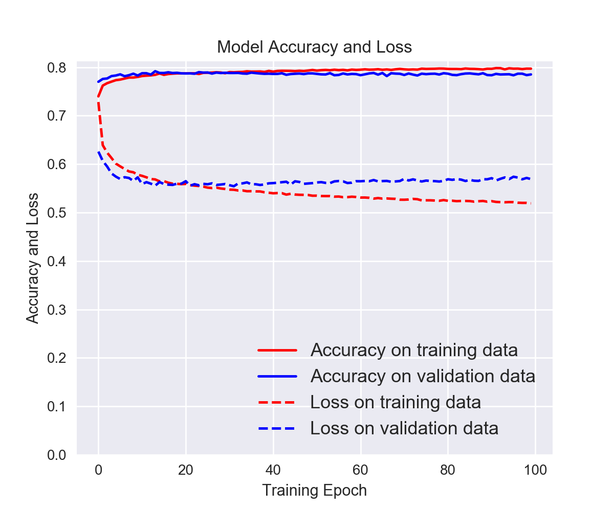

# Otto Product Identification
The Otto group is one of the world's biggest e-commerce companies selling products worldwide everyday. This requires constant analysis of products and correct classification. 

This is a classical classification problem with `93` features and more than `200,000` products. 

Data is taken from the [Kaggle Competition](https://www.kaggle.com/c/otto-group-product-classification-challenge/overview). 

## Methods and Results
The data consists of pre-labelled products from Classes  as `Class_1` to `Class_9`. The classification task is performed with a **Fully Connected Neural Network**. 

The train set in split as _train_ and _validation_.  The test set is not labelled so we are unable to evaluate the performance on the test set. 

The plots below shows the FCN performance. 

